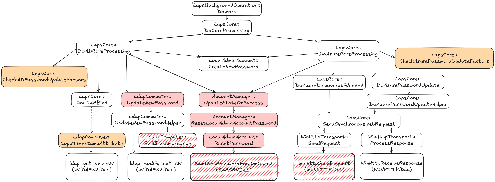

# Hooks

This document provides a detailed list of all functions that can be hooked using PoCs from this repository.

Legend:
- Orange Block: Forces a password reset during the next processing cycle, even if the current password is not expired.
- Red Block: Captures the cleartext password.
- Red Hachured Block: Captures the password and sets a custom LAPS password either locally or in the directory (AD or Entra ID), depending on the hooked function.

The offsets listed in this file are based on the laps.dll binary from the June 2025 update of Windows 11, with file version 10.0.26100.4202 and SHA-1 hash `2332A88D495808A5465A22494B93FB49A8F67A02`.
Scripts have also been run to extract offsets for the July 2025 update of Windows 11 (laps.dll 10.0.26100.4484 SHA-1 hash `FFDB394F063F51C79A254D2AA2AE3865CE8990D0`), though these offsets have not yet been fully tested.

## Frida / Frida-trace PoCs

Frida scripts and Frida-trace templates are named as follows: `{action}_{dllname}DLL_{function_name}.js` where:

- `action`:
  - `get`: Retrieve the LAPS password.
  - `set`: Set a custom LAPS password either locally (`samsrv.dll!SamISetPasswordForeignUser2`) or on the directory (Entra ID: `WINHTTP.dll!WinHttpSendRequest` / AD: `LdapComputer::BuildPasswordJson`).
  - `reset`: Force a password reset even if the current one is still valid.
- `dllname`: Target DLL (e.g., `laps`, `samsrv`, `WINHTTP`)
- `function_name`: Internal or exported function to hook. For functions in `laps.dll`, the name includes an extra `_` to reflect class scoping, e.g.: `AccountManager::ResetLocalAdminAccountPassword` → `AccountManager_ResetLocalAdminAccountPassword`

Note: if `dllname` is `laps`, hooks target internal (non-exported) functions using offsets. Scripts must be updated when `laps.dll` is updated (cf. [Generating Frida-trace / Frida PoCs for Other LAPS Versions](README.md#generating-frida-trace--frida-pocs-for-other-laps-versions)).

For `samsrv.dll` and `WINHTTP.dll`, hooks rely on function names, not on offsets.

| Action | DLL     | Function                                         | Offset (June 2025) | Scope    | Script                                                         |
|--------|---------|--------------------------------------------------|--------------------|----------|----------------------------------------------------------------|
| get    | laps    | `AccountManager::ResetLocalAdminAccountPassword` | 0x13C0C            | Both     | `get_lapsDLL_AccountManager_ResetLocalAdminAccountPassword.js` |
| get    | laps    | `AccountManager::UpdateStateOnSuccess`           | 0x14814            | Both     | `get_lapsDLL_AccountManager_UpdateStateOnSuccess.js`           |
| get    | laps    | `LdapComputer::BuildPasswordJson`                | 0x24A08            | AD       | `get_lapsDLL_LdapComputer_BuildPasswordJson.js`                |
| get    | laps    | `LdapComputer::UpdateNewPassword`                | 0x271BC            | AD       | `get_lapsDLL_LdapComputer_UpdateNewPassword.js`                |
| get    | laps    | `LocalAdminAccount::ResetPassword`               | 0x29B28            | Both     | `get_lapsDLL_LocalAdminAccount_ResetPassword.js`               |
| get    | samsrv  | `SamISetPasswordForeignUser2`                    | N/A (exported)     | Both     | `get_samsrvDLL_SamISetPasswordForeignUser2.js`                 |
| get    | WINHTTP | `WinHttpSendRequest`                             | N/A (exported)     | Entra ID | `get_WINHTTPDLL_WinHttpSendRequest.js`                         |
| reset  | laps    | `LapsCore::CheckADPasswordUpdateFactors`         | 0x1BA64            | AD       | `reset_lapsDLL_LapsCore_CheckADPasswordUpdateFactors.js`       |
| reset  | laps    | `LapsCore::CheckAzurePasswordUpdateFactors`      | 0x1C54C            | Entra ID | `reset_lapsDLL_LapsCore_CheckAzurePasswordUpdateFactors.js`    |
| reset  | laps    | `LdapComputer::CopyTimestampAttribute`           | 0x25724            | AD       | `reset_lapsDLL_LdapComputer_CopyTimestampAttribute.js`         |
| set    | WINHTTP | `WinHttpSendRequest`                             | N/A (exported)     | Entra ID | `set_WINHTTPDLL_WinHttpSendRequest.js`                         |
| set    | laps    | `LdapComputer::BuildPasswordJson`                | 0x24A08            | AD       | `set_lapsDLL_LdapComputer_BuildPasswordJson.js`                |
| set    | samsrv  | `SamISetPasswordForeignUser2`                    | N/A (exported)     | Both     | `set_samsrvDLL_SamISetPasswordForeignUser2.js`                 |

In the `overlapsed/LAPS_2332A88D495808A5465A22494B93FB49A8F67A02` folder, the "set" scripts for Frida-trace are not present.
To test them, modify the corresponding handler files using the templates provided in `poc_templates/frida-trace/`.

## Detours PoCs

Only `get`-type Detours PoCs are available. 

| Action | Function                                         | Offset (June 2025) | Scope | Project                                       |
|--------|--------------------------------------------------|--------------------|-------|-----------------------------------------------|
| get    | `AccountManager::ResetLocalAdminAccountPassword` | 0x13C0C            | Both  | SamISetPasswordForeignUser2                   |
| get    | `SamISetPasswordForeignUser2`                    | N/A (exported)     | Both  | AccountManager_ResetLocalAdminAccountPassword |

Hooking of `AccountManager::ResetLocalAdminAccountPassword` is performed by patching function offset.

Hooking of `samsrv.dll!SamISetPasswordForeignUser2` relies on exported function name.
