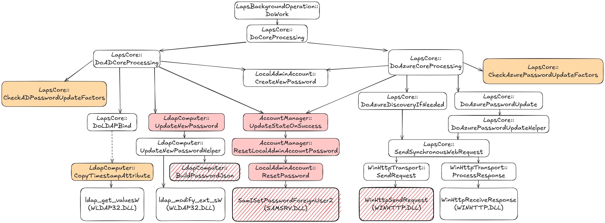
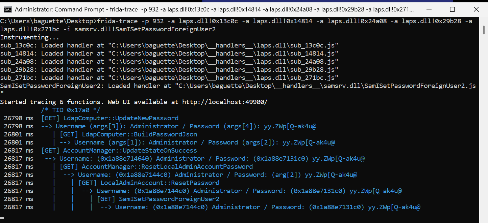

# OverLAPS

This repository supports the research talk **"OverLAPS: Overriding LAPS Logic"**. 

It contains Frida-based and Detours-based PoCs (including the one demonstrated in the talk) to assist in manipulating Windows LAPS.

For more information on LAPS (configuration, deployment, internals, etc.) refer to the [official Microsoft documentation](https://learn.microsoft.com/en-us/windows-server/identity/laps/laps-overview).

The graph below illustrates where hooks can be placed within the internal `laps.dll` call tree to override LAPS behavior and achieve one of the following:
- capture the cleartext password,
- set a custom LAPS password (either locally or in the directory, AD or Entra ID), causing a desynchronization between the machine's password and the one stored in the directory,
- or force a password reset during the next processing cycle, even if the current password is not expired.

Note that this represents only a subset of the full call tree, and other internal functions may also be viable targets for similar manipulation.




Legend:
- Orange Block: Forces a password reset during the next processing cycle, even if the current password is not expired.
- Red Block: Captures the cleartext password.
- Red Hachured Block: Captures the password and sets a custom LAPS password either locally or in the directory (AD or Entra ID), depending on the hooked function.

Additional Details are available in [HOOKS.md](HOOKS.md).

## Repository Structure

```
.
├── OverLAPSDetours/               # Detours PoCs (Visual Studio Project)
│
├── overlapsed/
│   └── LAPS_<HASH>/
│       ├── frida/                 # Standalone Frida scripts for hooking some LAPS/WinHTTP/SamSrv functions
│       ├── __handlers__/          # frida-trace handler scripts organized by target DLL
│       ├── info.txt               # Metadata: file versions, timestamps, signature info, etc. from sigcheck
│       └── offsets.txt            # Extracted offsets from laps.dll PDB for interesting internal functions
│
├── poc_templates/
│   ├── frida/                     # Frida hook templates
│   └── frida-trace/               # frida-trace script templates
│
├── scripts/
│   ├── extract_offsets.py          # Helper script to parse the output of cvdump and get function offsets
│   ├── frida-trace_to_frida_converter.py  # Helper script to convert frida-trace handlers into Frida scripts
│   └── main.ps1                   # PowerShell script to generate LAPS_<HASH> structure
│
└── tools/                         # Empty placeholder directory for third party binaries
    └── (empty)                    # cf. instructions section for details

```

The directory `overlapsed/LAPS_2332A88D495808A5465A22494B93FB49A8F67A02/` contains tested and working PoCs for the `laps.dll` binary version shipped with **Windows 11 24H2, June 2025 update** (File version: 10.0.26100.4202 | SHA-1: `2332A88D495808A5465A22494B93FB49A8F67A02`).
Scripts have also been run to extract offsets for the July 2025 update of Windows 11 (laps.dll 10.0.26100.4484 SHA-1 hash `FFDB394F063F51C79A254D2AA2AE3865CE8990D0`), though these offsets have not yet been fully tested.

This folder includes:
- Frida hooks
- frida-trace handlers
- Offset list
- LAPS binary metadata

## ⚠️ Requirements
- LAPS must be properly configured on the target system for the PoCs to work as expected.
- Some PoCs support both Entra ID and Active Directory setups; others are specific to one. For a detailed list of available PoCs, including hooked functions, offsets, and Entra ID / AD, refer to the [HOOKS.md](HOOKS.md) file.
- LSA Protection (RunAsPPL) must be disabled, as it prevents attaching to or injecting into LSASS.
- Local administrator privileges are required.

## Usage

For Frida-trace and Frida PoCs, ensure you have Python and Frida installed. Clone this repository, then adapt the commands as needed.

### Frida-trace
In an elevated prompt, from the `LAPS_<HASH>` folder:

```
frida-trace -p <lsass PID> -a laps.dll!0x13c0c -a laps.dll!0x14814 -a laps.dll!0x24a08 -a laps.dll!0x29b28 -a laps.dll!0x271bc -i samsrv.dll!SamISetPasswordForeignUser2
```




### Frida
In an elevated prompt, from the `LAPS_<HASH>/frida` folder:

```
frida -p <lsass PID> -l get_lapsDLL_AccountManager_ResetLocalAdminAccountPassword.js
```


### Detours
The `OverLAPSDetours` folder contains two PoCs that capture LAPS credentials when password is updated. They work in both AD and Entra ID setups.

#### AccountManager_ResetLocalAdminAccountPassword
- Hooks the internal LAPS function `AccountManager::ResetLocalAdminAccountPassword`.
- Offset is defined in `Hook.cpp`.
- Current value: `0x13C0C` (June 2025 version).
- To target another version, update `#define OFFSET 0x13C0C`.

#### SamISetPasswordForeignUser2
- Hooks the undocumented function `samsrv.dll!SamISetPasswordForeignUser2`.
- No modifications required.

#### Dependencies

The following files are included from the Microsoft Detours project (MIT License):
- `OverLAPSDetours/Detours/include/detours.h`
- `OverLAPSDetours/Detours/include/detver.h`
- `OverLAPSDetours/Detours/include/detours.lib`: this library was built following [these instructions](https://github.com/microsoft/Detours/wiki/FAQ#where-can-i-find-detourslib-and-detoursh). You can rebuild it if needed.

#### To use the PoCs
- Build the project using Visual Studio (Debug or Release).
- On the target system:
    - Create the folder `C:\LAPS` (or modify the code to use a different path).
    - Inject one or both DLLs into the `lsass.exe` process (requires administrator rights).
    - Trigger a LAPS password change (e.g., wait for expiration or force a reset via Frida).

#### Output

Depending on the injected DLLs, credentials will be written to:
- `C:\LAPS\AccountManager_ResetLocalAdminAccountPassword.txt`
- `C:\LAPS\HookSamISetPasswordForeignUser2.txt`

If compiled in Debug mode, additional debug logs will be created to verify DLL loading/unloading and hook attachment:
- `C:\LAPS\AccountManager_ResetLocalAdminAccountPassword_DEBUG.txt`
- `C:\LAPS\HookSamISetPasswordForeignUser2_DEBUG.txt`

## Generating Frida-trace / Frida PoCs for Other LAPS Versions

The project includes helper scripts to automate the creation of version-specific Frida PoCs.

1. Download required tools into the `tools/` directory:
    - [sigcheck.exe](https://download.sysinternals.com/files/Sigcheck.zip)
    - [pdblister.exe](https://github.com/microsoft/pdblister/releases/)
    - [cvdump.exe](https://github.com/microsoft/microsoft-pdb/blob/master/cvdump/cvdump.exe)

2. Run the script `./scripts/main.ps1`. This will generate a new `LAPS_{SHA1}` folder under `overlapsed/`, adapted to your `laps.dll` version.

### What `main.ps1` does:
1. Computes SHA-1 of `laps.dll` (default: `C:\Windows\System32\laps.dll`, edit the script for another location).
2. Creates `overlapsed/LAPS_{SHA1}`.
3. Uses `sigcheck` to extract file metadata → `info.txt`.
4. Uses `pdblister` to fetch the matching PDB file.
5. Uses `cvdump` to extract selected function offsets → `offsets.txt`. (Edit `extract_offsets.py` to change target functions.)
6. Creates new Frida PoCs by templating from `poc_templates/`, inserting the correct offsets.

## Notes
- For educational and research purposes only.
- Always obtain permission before running PoCs on any system.
- `frida-trace_to_frida_converter.py` is a utility to convert frida-trace handlers to standalone scripts. It should be run before `main.ps1` if you are creating / modifying handlers in `poc_templates/frida-trace/`.

## License

MIT License

## Contact
For questions, open an issue or reach out via social media (I am easy to find).

